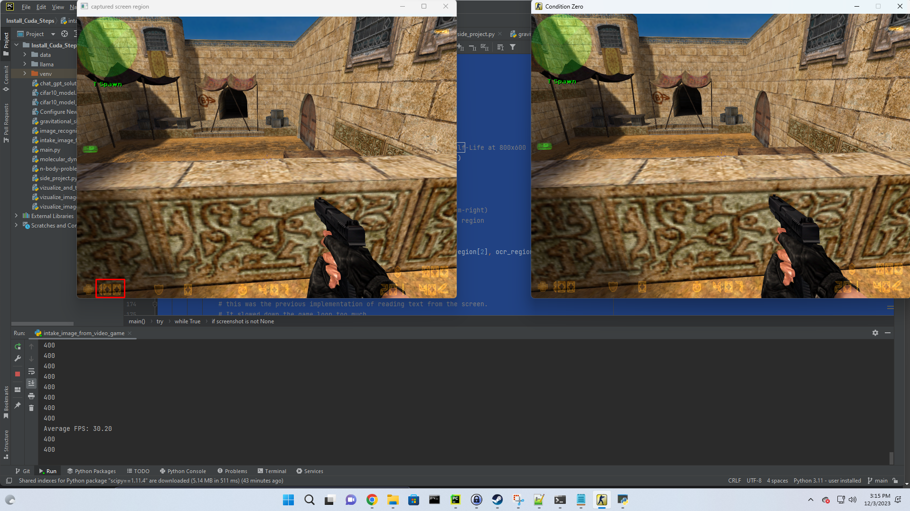

# Counter-Strike: Condition Zero Deep Learning Bot attempt
# Screen Reading Bot Project

## Overview
This project is an experimental endeavor to create a bot that can read and interpret information from a video game screen in real-time. The primary goal is to explore the capabilities of OCR (Optical Character Recognition) in a dynamic gaming environment and to develop a bot that can make decisions based on the screen data it reads.

## Experiment Details
The bot is designed to capture specific regions of a game screen, process the images, and extract meaningful information using OCR technology. This information is then used to make informed decisions within the game. The project serves as a practical application of image processing and machine learning techniques in a real-world scenario.

### Key Features
- Real-time screen capture and processing.
- Use of OCR to read and interpret screen text.
- Multithreading to enhance performance and maintain high frame rates.
- Integration of EasyOCR for improved text recognition accuracy.

### Technologies Used
- Python
- OpenCV (for image processing and screen capture)
- EasyOCR (for Optical Character Recognition)
- Threading (for performance optimization)

## Project Status
This project is currently in the experimental stage. It serves as a proof of concept for using OCR in video game environments and is continually being refined and improved.

## How to Use
1. Clone the repository to your local machine.
2. Ensure all dependencies are installed, including Python, OpenCV, and EasyOCR.
3. Run the script and observe.

## Future Work
- Enhance OCR accuracy and processing speed.
- Expand the bot's decision-making capabilities based on screen data.
- Explore the integration of additional machine learning techniques.

## Contributions
Contributions, ideas, and feedback are welcome to improve the bot and expand its capabilities.

---

*This README is part of the Screen Reading Bot Project, an experimental venture in applying OCR technology in video game environments.*

